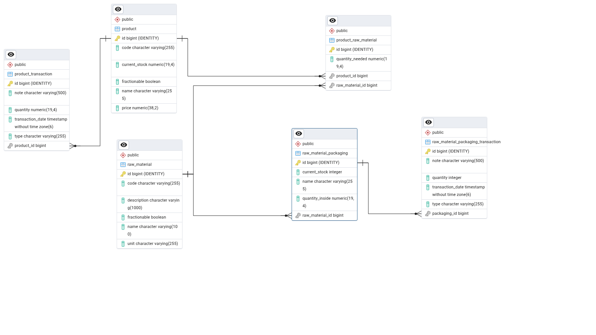
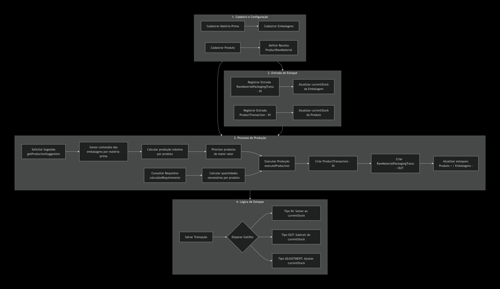
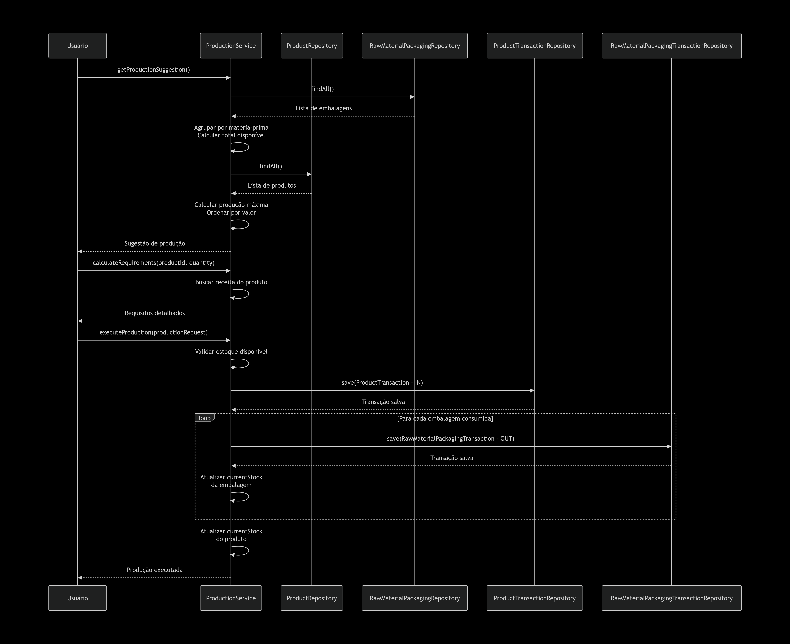
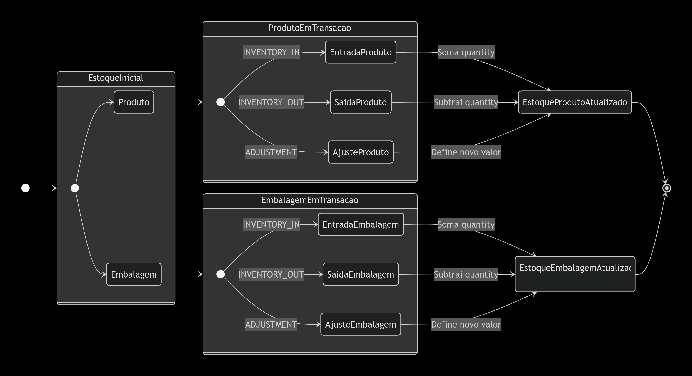

# Inventory & Production Manager API

Sistema de gerenciamento de inventário e produção desenvolvido como parte de um teste técnico. O objetivo principal é controlar o estoque de insumos (matérias-primas) e sugerir a produção de itens acabados com base na disponibilidade, priorizando produtos de maior valor.

## Descrição do Problema

Uma indústria que produz produtos diversos necessita controlar o estoque dos insumos (matérias-primas) necessárias para a produção dos itens que fabrica. O sistema permite:
- Manter o controle dos produtos e das matérias-primas.
- Associar produtos às matérias-primas que o compõem, com as respectivas quantidades necessárias.
- Consultar quais produtos e quantidades podem ser produzidos com base no estoque atual.
- Priorizar a sugestão de produção pelos produtos de maior valor.

## Requisitos do Projeto

### Requisitos Não Funcionais (RNF)
- **Construção de API**: Separação clara entre backend e frontend.
- **Persistência de Dados**: Utilização de SGBD (configurado para H2/PostgreSQL).
- **Língua Inglesa**: Codificação de backend, tabelas e colunas desenvolvidas em inglês.
- **Framework**: Backend desenvolvido em Spring Boot.

### Requisitos Funcionais (RF)
- CRUD de produtos (incluindo código, nome e valor).
- CRUD de matérias-primas (incluindo código, nome e estoque).
- Associação de matérias-primas aos produtos.
- Consulta de sugestão de produção baseada em estoque e valor unitário.
- Registro flexível de transações de estoque (entradas, saídas e produções reais).

---

## Documentação Interativa (Swagger)

A documentação detalhada dos endpoints, incluindo modelos de requisição e resposta, pode ser acessada via Swagger UI:

**Link local: [http://localhost:8080/swagger-ui/index.html](http://localhost:8080/swagger-ui/index.html)**

---

## Detalhamento dos Endpoints

### Produção (Production)
- `GET /api/production/suggest`: Retorna uma lista de produtos sugestivos para produção baseada no estoque atual de insumos, ordenada pelo preço unitário dos produtos (do maior para o menor).
- `GET /api/production/requirements?productId={id}&quantity={n}`: Calcula a quantidade total de cada matéria-prima necessária para produzir `n` unidades do produto especificado.
- `POST /api/production/execute`: Executa o processo de produção. Recebe um objeto com a lista de produtos produzidos e insumos efetivamente consumidos, gerando as transações de estoque correspondentes.

### Produtos (Products)
- `GET /api/products`: Lista todos os produtos cadastrados.
- `GET /api/products/{id}`: Busca um produto pelo ID interno.
- `GET /api/products/code/{code}`: Busca um produto pelo seu código de referência.
- `POST /api/products`: Cria um novo produto.
- `PUT /api/products/{id}`: Atualiza os dados de um produto existente.
- `DELETE /api/products/{id}`: Remove um produto.
- `POST /api/products/{id}/raw-materials`: Associa uma matéria-prima a um produto com uma quantidade específica.

### Matérias-Primas e Embalagens (Raw Materials & Packagings)
- `GET /api/raw-materials`: Lista todas as matérias-primas.
- `GET /api/raw-materials/code/{code}`: Busca matéria-prima pelo código.
- `GET /api/raw-materials/packagings`: Gerencia as apresentações físicas (embalagens) dos insumos em estoque.

### Transações de Estoque (Transactions)
- `POST /api/product-transactions`: Registra manualmente entradas, saídas ou ajustes no estoque de produtos acabados.
- `POST /api/packaging-transactions`: Registra entradas ou saídas de embalagens de insumos, atualizando o saldo disponível de matéria-prima.

---

## Diagramas do Sistema

### Diagrama de Entidade-Relacionamento (ERD)
Descreve a estrutura das tabelas e os vínculos entre Produtos, Insumos, Embalagens e Transações.

### Fluxograma de Processos
Demonstra o fluxo operacional desde o recebimento de insumos até a produção final.

### Diagrama de Sequência
Detalha a interação entre os serviços durante a execução de uma produção.

### Diagrama de Estados do Estoque
Descreve como as transações afetam o estado do inventário.

---

## Tecnologias Utilizadas
- Java 21
- Spring Boot 3.4.2
- Spring Data JPA (Hibernate)
- H2 Database (Desenvolvimento) / PostgreSQL (Produção)
- Lombok
- SpringDoc OpenAPI v3 (Swagger UI)
- Maven
