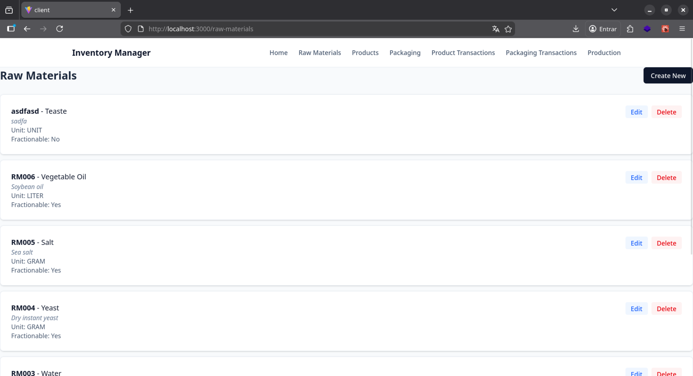
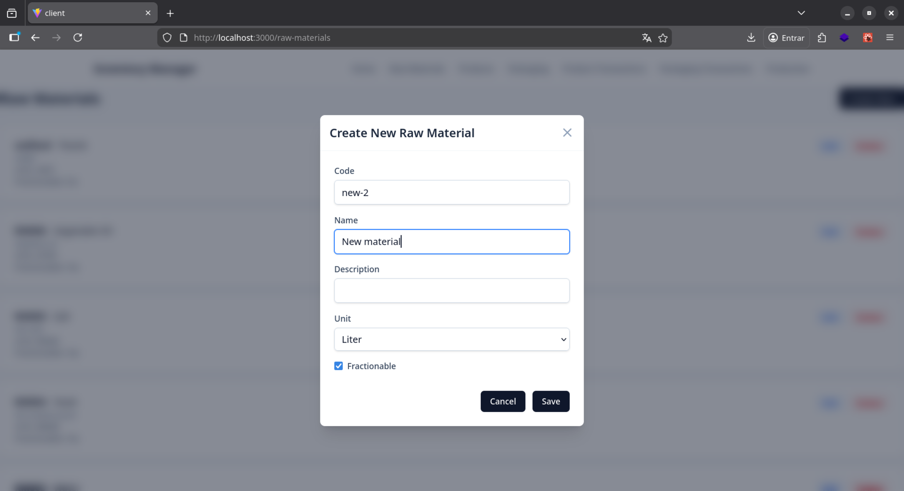
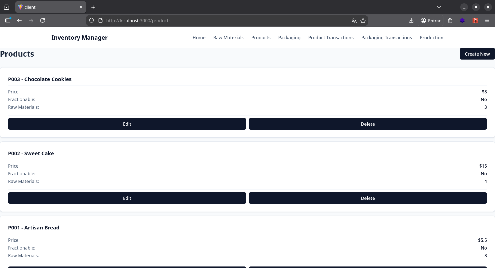
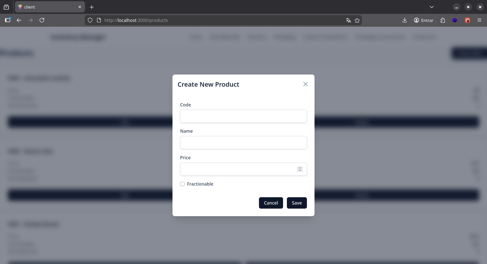
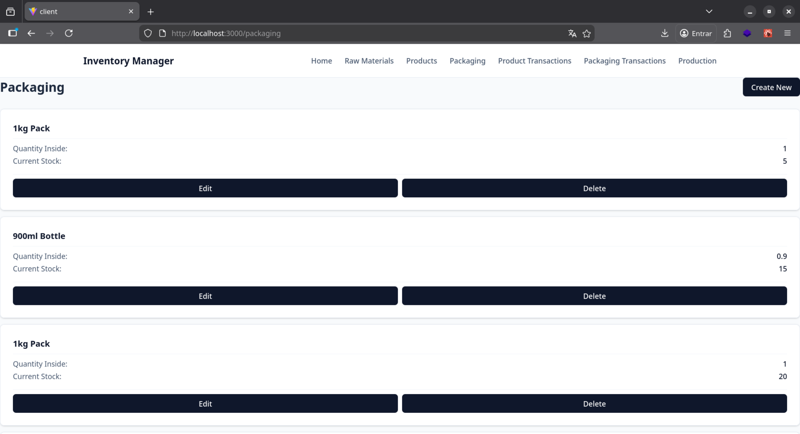
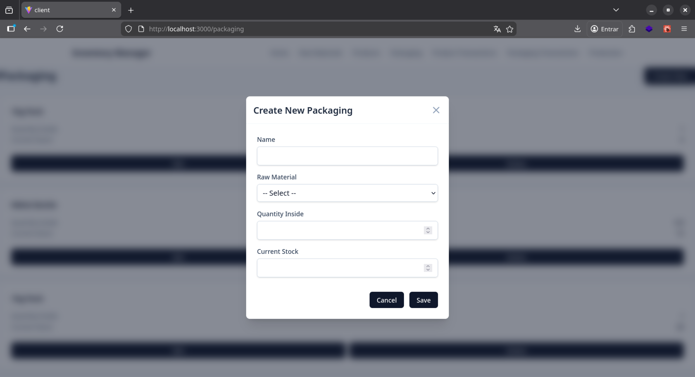
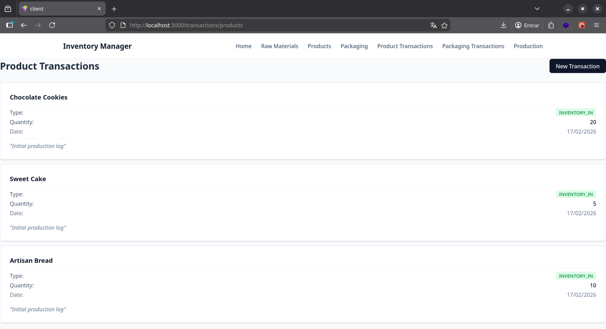
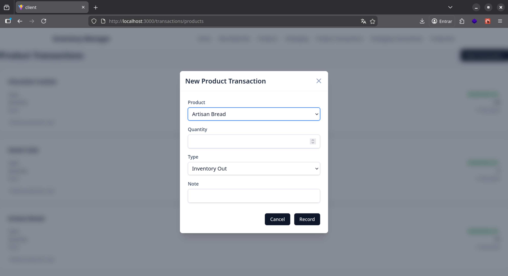
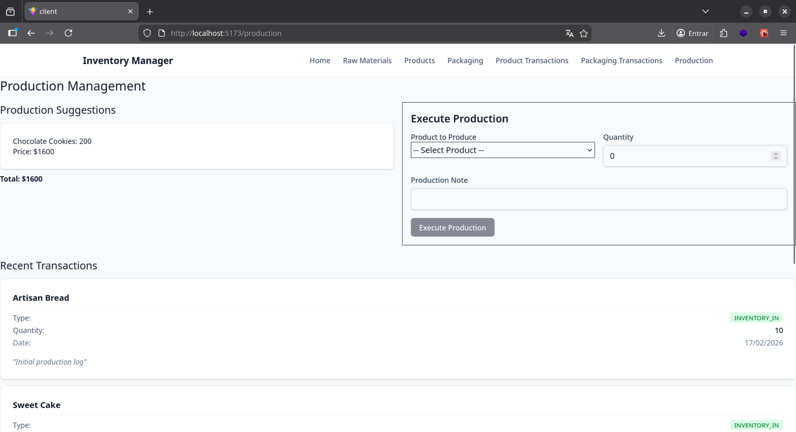

# Inventory Manager Client

A modern, responsive frontend for the Inventory Manager system, built with **React**, **TypeScript**, **Vite**, and **Tailwind CSS**. This application manages raw materials, products, packaging, and production workflows.

## Tech Stack

-   **Framework**: [React 19](https://react.dev/)
-   **Build Tool**: [Vite](https://vitejs.dev/)
-   **Language**: [TypeScript](https://www.typescriptlang.org/)
-   **State Management**: [Redux Toolkit (RTK)](https://redux-toolkit.js.org/) & [RTK Query](https://redux-toolkit.js.org/rtk-query/overview)
-   **Styling**: [Tailwind CSS v4](https://tailwindcss.com/)
-   **Testing**: [Vitest](https://vitest.dev/) & [React Testing Library](https://testing-library.com/)

## Screenshots

| Raw Materials List | Raw Materials Create |
| :---: | :---: |
|  |  |

| Products List | Product Create |
| :---: | :---: |
|  |  |

| Packaging List | Packaging Create |
| :---: | :---: |
|  |  |

| Product Transactions | Product Transaction Create |
| :---: | :---: |
|  |  |

| Production Screen |
| :---: |
|  |

## Architecture & State Management

### Redux Toolkit & RTK Query
The application uses **RTK Query** for efficient data fetching and caching. The entire API definition resides in `src/services/api.service.ts`.

-   **Centralized API**: Defined using `createApi`, allowing automatic hook generation (e.g., `useGetProductsQuery`, `useCreateProductMutation`).
-   **Tag Invalidation**: We implement a robust tag system (`RawMaterial`, `Product`, `Packaging`, etc.) to automatically refresh data across the app when mutations (create/update/delete) occur.
    -   *Example*: Creating a new product automatically invalidates the `Product` tag, causing the product list to re-fetch without manual state updates.

### API Typing
Type safety is enforced via Data Transfer Objects (DTOs) defined in `src/services/api.types.ts`.
-   **Enums**: `Unit`, `TransactionType`.
-   **Interfaces**: `ProductDTO`, `RawMaterialDTO`, `ProductionExecutionDTO`, etc.
-   These types ensure that the frontend and backend contracts are strictly respected.

### Services Layer
The service layer abstracts all HTTP communication:
-   **Raw Materials**: CRUD for base materials using `Unit` enums.
-   **Products**: Manages products and their composition (recipes) of raw materials.
-   **Packaging**: Tracks packaging inventory linked to specific raw materials.
-   **Transactions**: Records `IN` and `OUT` movements for products and packaging.
-   **Production**: Handles the logic of consuming materials and packaging to produce finished products.

## Testing

We use **Vitest** for integration testing.

-   **Integration Tests**: Located in `src/services/api.service.integration.test.ts`.
-   **Strategy**: Tests spin up a real Redux store and dispatch actual async thunks to verify the full lifecycle:
    1.  Create resources (Raw Material -> Product).
    2.  Verify they appear in lists.
    3.  Perform transactions.
    4.  Update and Delete.
    5.  Verify side effects (cascading deletes, cache updates).

To run tests:
```bash
npm test
```

## Getting Started

### Prerequisites
-   Node.js (v18 or higher recommended)
-   npm or yarn

### Installation

1.  Clone the repository:
    ```bash
    git clone https://github.com/your-repo/inventory-manager-client.git
    ```
2.  Install dependencies:
    ```bash
    npm install
    # or
    yarn
    ```

### Running the Application

1.  Make sure the backend API is running.
2.  Start the development server:
    ```bash
    npm run dev
    ```
3.  Open [http://localhost:5173](http://localhost:5173) in your browser.

### Building for Production

```bash
npm run build
```
This generates a production-ready build in the `dist` folder.
